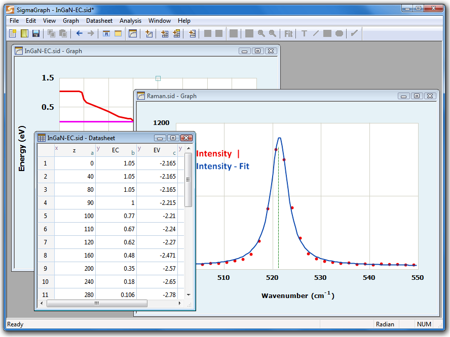

# SigmaGraph: Data Plotting and Analysis Software  
(C) 1997-2020  Pr. Sidi HAMADY  
http://www.hamady.org  
sidi@hamady.org  

See Copyright Notice in COPYRIGHT

SigmaGraph is a data plotting and analysis software designed to be lightweight, reliable and easy to use.  
SigmaGraph runs on Windows XP, Vista and Windows 7/8/10. SigmaGraph offers almost all the functionality needed by scientists and engineers:  
* editable datasheets (column properties, create series, set column values by using any mathematical expression, show column statistics, import/export from/to ASCII file, mask and unmask cells, printing, etc.);
* scientific graphing with a complete control of the graph (line/symbol style, colors, fonts, legends, axis properties, grid, tick, labels, scale, auto scale, log/linear scale, zoom in/out, copy format to another graph, export
as image, printing, graph templates, etc.);
* curve fitting (24 models including linear, polynomial, exponential, Gaussian (up to 5 peaks), Lorentzian (up to 5 peaks), Pearson VII, logistic, power, etc.);
* error bars (percentage, constant or any user defined data); drawing tools (line,rectangle, ellipse); mathematical console;
* powerful scripting engine; customizable script editor with syntax highlighting, code completion, etc.

SigmaGraph is now open-source and released under the MIT license since its version 2.6.10.

## Install

To install SigmaGraph just copy the portable binary distribution from the Dist\SigmaGraph directory to any location (such as usb key)
and run SigmaGraph.exe (located in the bin directory). The zipped binary distribution is also available to download here: [Dist/sigmagraph_portable_windows.zip](https://github.com/sidihamady/SigmaGraph/blob/master/Dist/sigmagraph_portable_windows.zip).
The SigmaGraph documentation is included in the help directory.

## Build

SigmaGraph uses the Microsoft Foundation Classes (MFC) and Visual C++ (VC). The last VC version I used (and still using now (2018)) was Visual C++ 2013.

If you do not have VC already installed, download the Community version of VC (included in Visual Studio) with the MFC libraries.

All the build process is handled by the batch file msvcbuild.bat.  
Edit msvcbuild.bat to adapt it to your VC configuration. Open the solutions to upgrade to the installed VC release.  
The MFC is statically linked to the SigmaGraph modules.

When ready, open a VC developper command prompt and run msvcbuild.bat.  
The binary distribution is built and copied to the Dist\SigmaGraph directory.  
Just copy this distribution directory ( Dist\SigmaGraph ) to any location (usb key for instance) to use SigmaGraph.  
The zipped binary distribution is also available to download here: [Dist/sigmagraph_portable_windows.zip](https://github.com/sidihamady/SigmaGraph/blob/master/Dist/sigmagraph_portable_windows.zip)
You can also build the HTML help files, using [HTML Help Workshop}(https://www.microsoft.com/en-us/download/details.aspx?id=21138): run helpbuild.bat located in the Help directory. This step must be done before building the whole distribution in order to include the compiled html help files in the zip.

SigmaGraph consists of the following modules (each in a separate VC solution):  
* LibCalc: Mathematical and scientific routines and the Lua engine.
* LibGraph: 2D plotting core.
* LibScintilla: Lua editor control.
* SigmaConsole: the mathematical expression-based calculator.
* SigmaGraph: the SigmaGraph main module.

I have been commenting the code, sometimes in french and in english sometimes. As far as possible, I will translate everything to english.

## Changelog

* SigmaGraph v2.6.10 (release: november 23, 2018)  
Source code released under the MIT license. Available in github.  
Added an auto-export option to automatically save data in ASCII format and plot in SVG format.  
Bugfixes.  

* SigmaGraph v2.6.9 (release: january 05, 2017)  
Multi-peak fitting updated;  
New 'Auto Export' option, to automatically save data in text file and plot in SVG format;  
Bugfixes.  

* SigmaGraph v2.6.8 (release: january 01, 2017)  
bugfixes.  
autoscale improved.  

* SigmaGraph v2.6.8 (release: february 21, 2016)  
Improvements and bug fixes, including:  
SVG support improved with Unicode support.  
Datasheet performance improved.  
Plot autoscale function rewritten with a new fast algorithm.  

* SigmaGraph v2.6.6 (release: december 28, 2015)  
bugfixes;  
EMF and SVG vector format.  

* SigmaGraph v2.6.4 (release: october 30, 2014)  
bugfixes;  
Keyboard arrows to move graphical objects.  

* SigmaGraph v2.6 (release: may 13, 2014)  
New fitting functions: Multi-peak Gauss and Lorentz (up to 5 peaks);  
Scripting engine updated with new mathematical and statistical functions;  
Script editor enhanced with new options: syntax highlighting, line numbers, markers, autocompletion, ...  
Data importing new options;  
Graph printing bug on some devices corrected;  
Help system redesigned (integrated HTML Help and PDF);  
User interface enhancements;  
Performance improvement.  
Bugfixes.  

* SigmaGraph v2.4 (release: january 06, 2010)  
First public release.  

* SigmaGraph v1.0 up to v2.2 (release: 1998 up to 2010): non-public versions.  
Used only in my own academic projects to replace commercial tools.  
The first public version (v2.4) was released back in 2010.  
